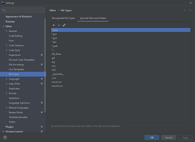

# TConcept-GPAO

## Logique des branches principales
Ce projet comporte les branches principales suivantes:
   - develop
   - test
   - preprod
   - master

La logique d'enchainement de ces branches est la suivante:
   - develop --> test --> preprod --> master
   - La branche develop est la branche de développement. C'est sur cette branche que les développeurs travaillent.
   - La branche test est la branche de test. C'est sur cette branche que les responsables métiers testent toutes les fonctionnalités développées.
   - La branche preprod est la branche de pré-production. C'est sur cette branche que les fonctionnalités sont validées par les utilisateurs finaux.
   - La branche master est la branche de production. C'est sur cette branche que les fonctionnalités sont déployées pour les utilisateurs finaux.

## Installation

Le projet est prévu pour s'installer sur un système d'exploitation en base Linux. Il est possible sur Windows d'utiliser
des outils comme le [WSL 2](https://docs.microsoft.com/fr-fr/windows/wsl/install).

### Make

Le processus d'installation est automatisé grâce à la commande `make`. Pour l'utiliser, assurez-vous que le paquet
`make` est installé sur votre système. Pour l'installer sur une distribution basée sur Debian, exécutez la commande
suivante&nbsp;:

```sh
sudo apt install make
```

### Docker

Ce projet utilise Docker pour la gestion des conteneurs. Pour l'installer, suivez les instructions sur le site
officiel&nbsp;: [https://docs.docker.com/get-docker/](https://docs.docker.com/get-docker/).
Plus particulièrement, le projet utilise Docker Compose. Pour l'installer, suivez les instructions sur le site
officiel&nbsp;: [https://docs.docker.com/compose/install/](https://docs.docker.com/compose/install/).

### Variables d'environnement
Les variables d'environnement sont définies dans le fichier `.env`. Pour les modifier, copiez le fichier `.env`.
Les différents environnements sont les suivants&nbsp;:
   - `dev`&nbsp;: environnement de développement&nbsp;;
   - `test`&nbsp;: environnement de test&nbsp;;
   - `preprod`&nbsp;: environnement de pré-production&nbsp;;
   - `prod`&nbsp;: environnement de production&nbsp;.

En fonction de l'environnement choisi, le fichier `.env` doit être renommé en `.env.dev.local` pour l'environnement de développement
ou en `.env.test.local` pour l'environnement de test, etc.

### Processus d'installation
   1. Copiez le fichier `.env` en fonction de l'environnement choisi&nbsp;;
   2. Exécuter la commande `make build` pour construire les conteneurs Docker&nbsp;;
   3. Exécuter la commande `make up-dev` pour démarrer les conteneurs Docker en mode develop&nbsp;;
   4. Exécuter la commande `make php` pour entrer dans le conteneur PHP&nbsp;;
   5. Exécuter la commande `composer install` pour installer les dépendances PHP&nbsp;;
   6. Exécuter la commande `yarn` pour installer les dépendances JavaScript&nbsp;;
   7. Exécuter la commande `gpao:database:load` pour charger la base de données&nbsp;;
   8. Exécuter la commande `yarn dev` pour compiler les assets en mode développement&nbsp;; ou `yarn build` pour compiler les assets en mode production

### PhpStorm

Une fois le projet installé, vous pouvez l'ouvrir avec votre IDE. Attention, sous PhpStorm, l'installation de PHPStan
peut poser des problèmes d'indexation. Pour les résoudre, il faut ignorer les fichiers `.phar`&nbsp;:<br/>


## Conteneurs

Différents conteneurs Docker sont utilisés pour les différents services du projet&nbsp;: (attention les noms de conteneurs 
peuvent varier en fonction de l'environnement choisi)

- `tconcept_gpao_apache`&nbsp;: conteneur responsable d'Apache 2, le serveur HTTP accessible grâce
  à [http://localhost:8000](http://localhost:8000). C'est ici que l'on peut utiliser l'application&nbsp;;
- `tconcept_gpao_mysql`&nbsp;: conteneur responsable de MySQL, le système de gestion de base données&nbsp;;
- `tconcept_gpao_php`&nbsp;: conteneur responsable de PHP, pour gérer la version du langage utilisé et pour exécuter les
  différentes commandes Symfony&nbsp;;
- `tconcept_gpao_phpmyadmin`&nbsp;: conteneur responsable de phpMyAdmin, pour avoir une interface de la base de données,
  accessible grâce à [http://localhost:8080](http://localhost:8080).

## Cron

Des crons peuvent être définis grâce à l'attribut `App\Attributes\CronJob`. Les commandes ensuite associées sont les
suivantes&nbsp;:

```sh
gpao:cron --scan # Analyse les commandes et créer les CRON en base de données.
gpao:cron # Lance les CRON.
```
### Devises

Le taux de change des devises est mis à jour par une tâche cron selon la commande `gpao:currency:rate`.

## Qualité du code

Pour modifier et contrôler le code quant aux standards définis pour le projet, utilisez la
commande&nbsp;: `gpao:fix:code`.

## Redis

Ce projet utilise Redis pour gérer une partie du cache.

Pour ce connecter à redis en mode client, utiliser la commande suivante depuis WSL
`make redis-cli`

Les principales commandes 'redis' à connaitre sont les suivantes:

   - Lister toutes les clés présentes: `keys "*"`
   - Supprimer toutes les clés présentes: `flushall`
